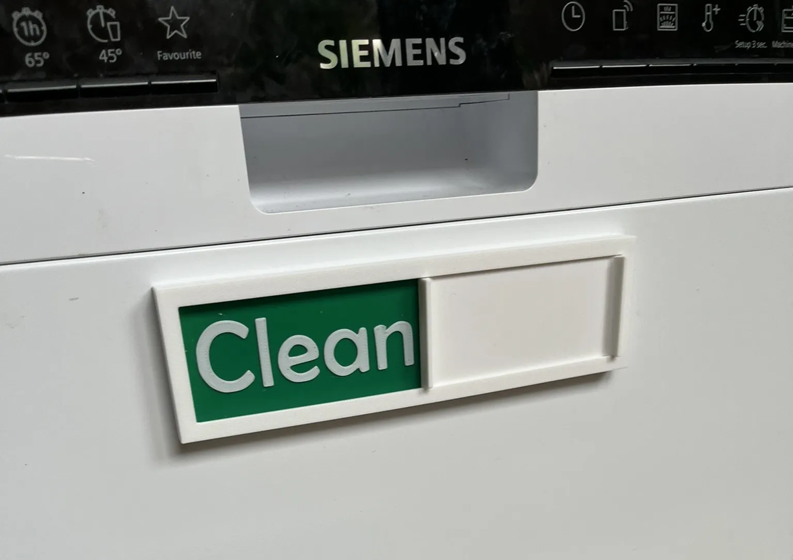
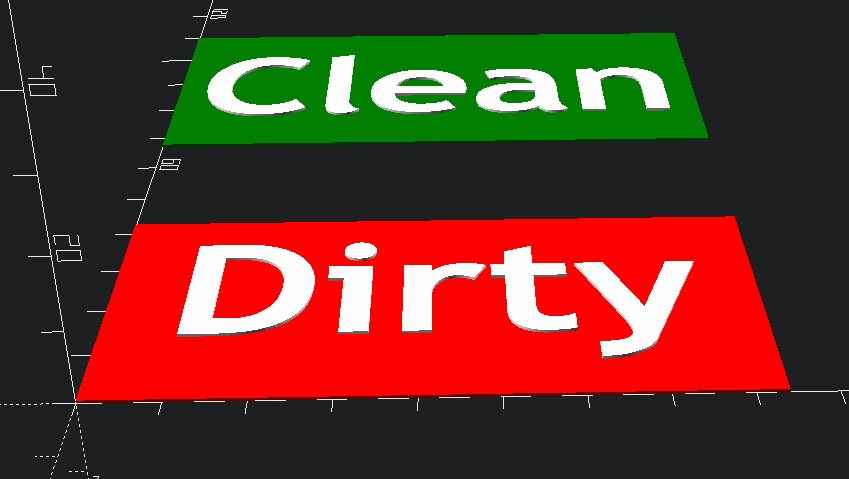
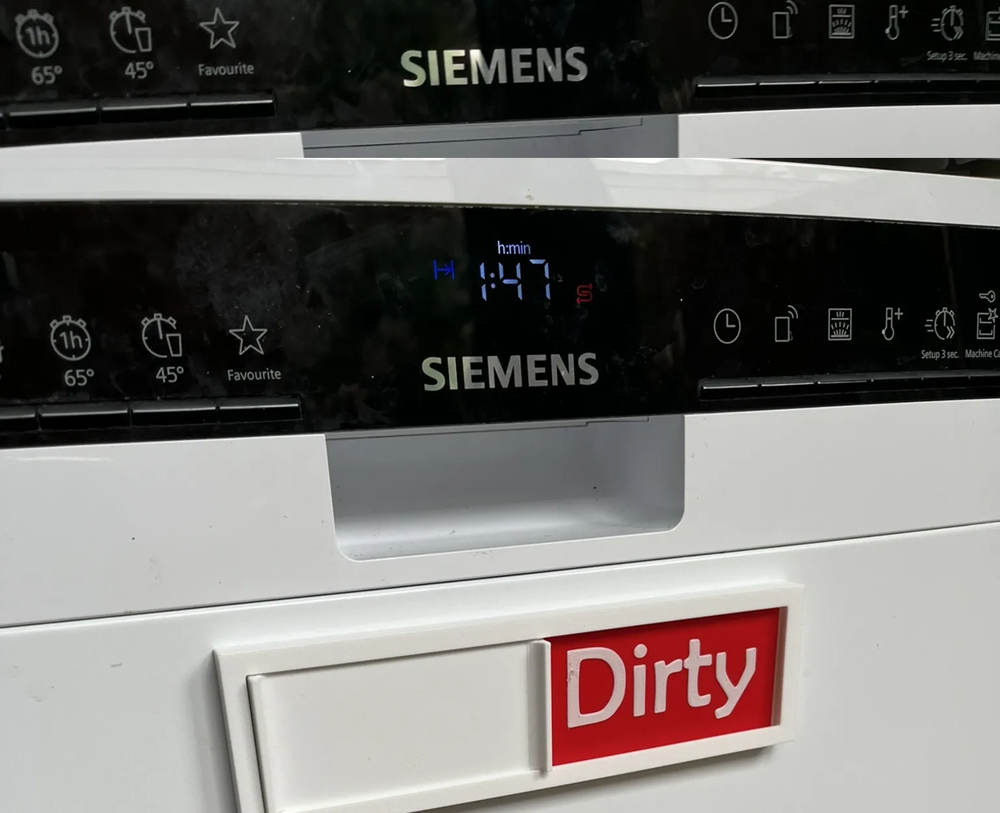
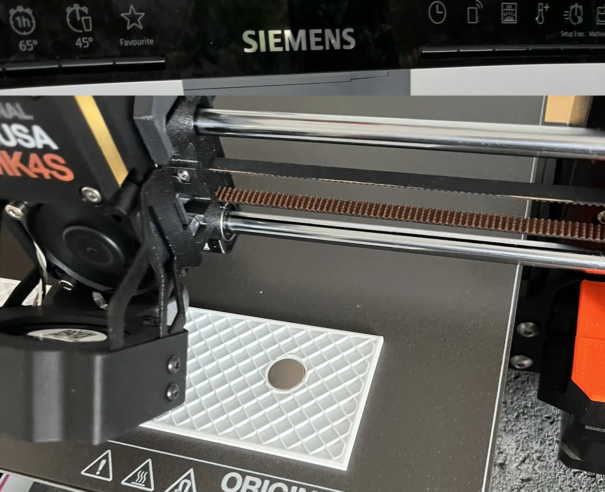

Colored plates for [Bergeron720's dishwasher sign](https://makerworld.com/en/models/965214-clean-dirty-dishwasher-sign?from=search#profileId-935601). Supports single nozzle; no MMU required. Parametric.
You need to download and print the base unit from Makerworld, then use this design for the insert plates.

### Customize
You can customize these plates to any text or font:
1. download the openscad file
2. modify the parameters
3. render a new design
4. export the STL

### Print
To print these plates, ensure that the final height is less than 1mm. Use the following slicer settings:
* Layer height = 0.2mm
* 2 walls
* Add a pause or color change after the 2nd layer.

It should print 2x layers in the base color, and 2x layers in the top color. Four layers in total.

### Magnets
I'd suggest to add holes into the base to embed magnets. It's a bit of extra work now, but it means if the sign breaks in the future, you can still rescue the magnets for a different project. My magnets were 12mm diameter, 2mm thickness.

### Other
* Tested on Prusa MK4S, in Prusament PLA.
* Model is available on [Github](https://github.com/RobotAnna/3D_Designs/tree/main/Dishwasher_Sign_colored_plates), [Printables](https://www.printables.com/model/1320733-dishwasher-sign-colored-plates-parametric), [Thingiverse](https://www.thingiverse.com/thing:7119479) and [Makerworld](https://makerworld.com/en/models/1705294-dishwasher-sign-colored-plates-parametric).
* Feel free to ask questions.
