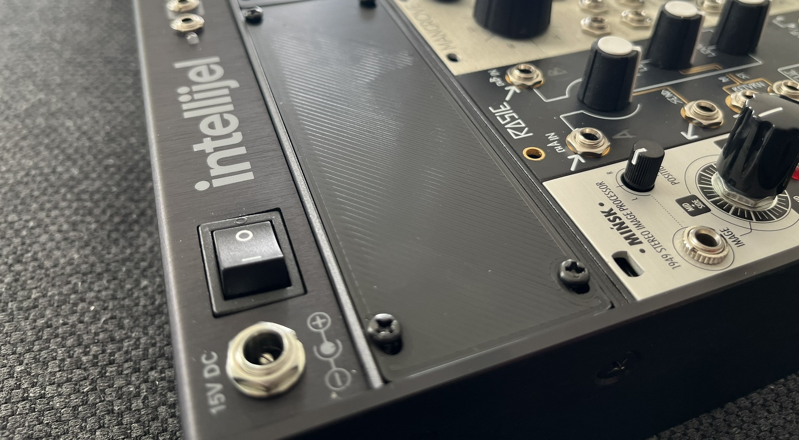
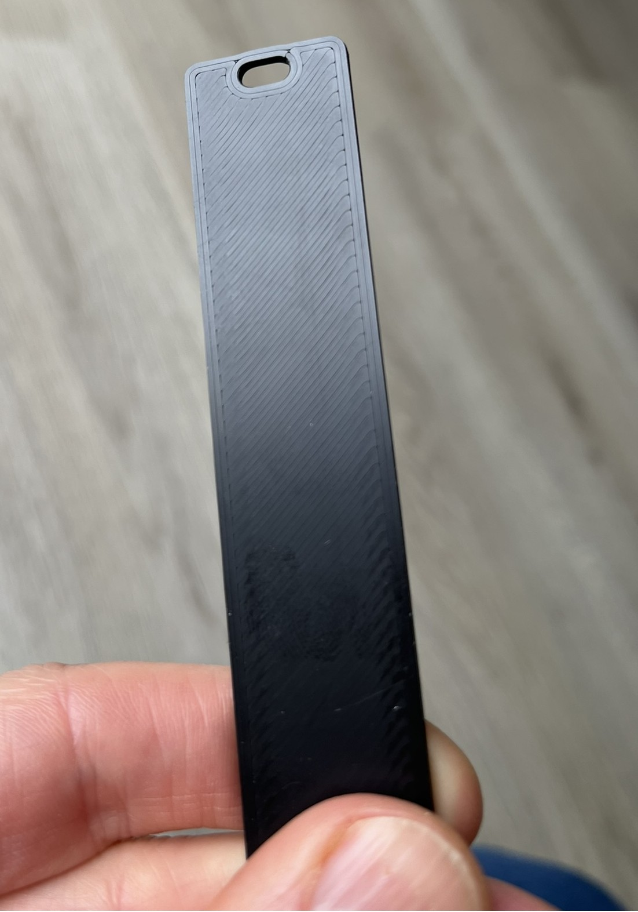
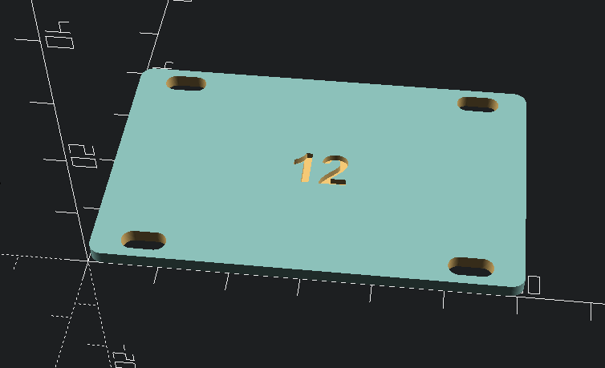
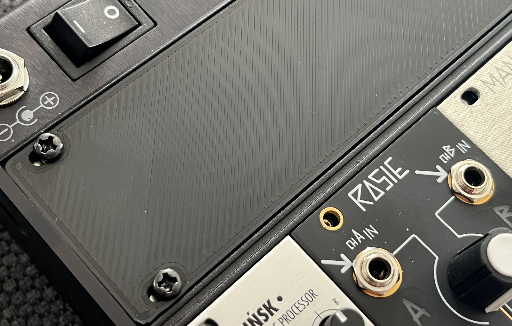
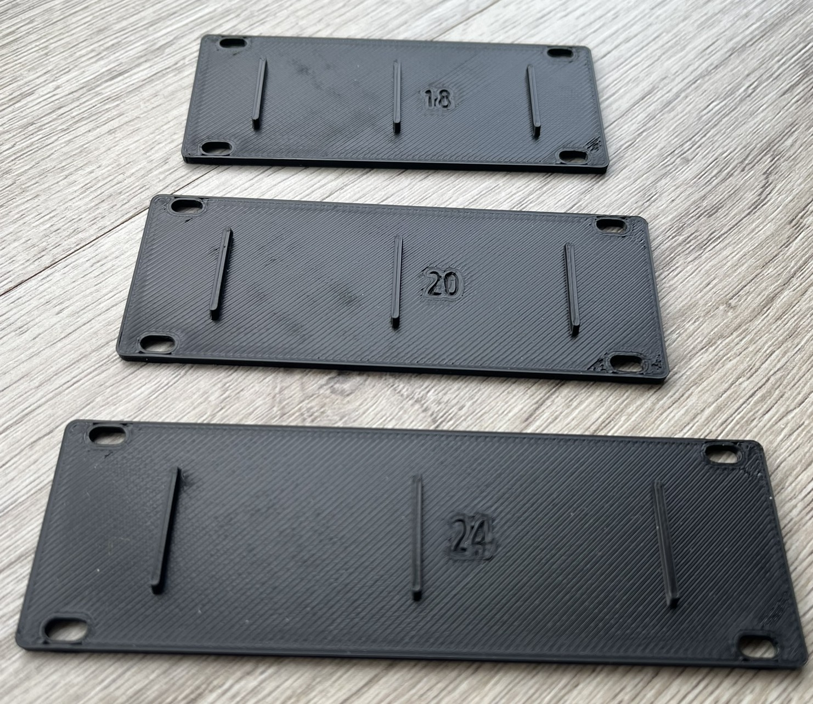
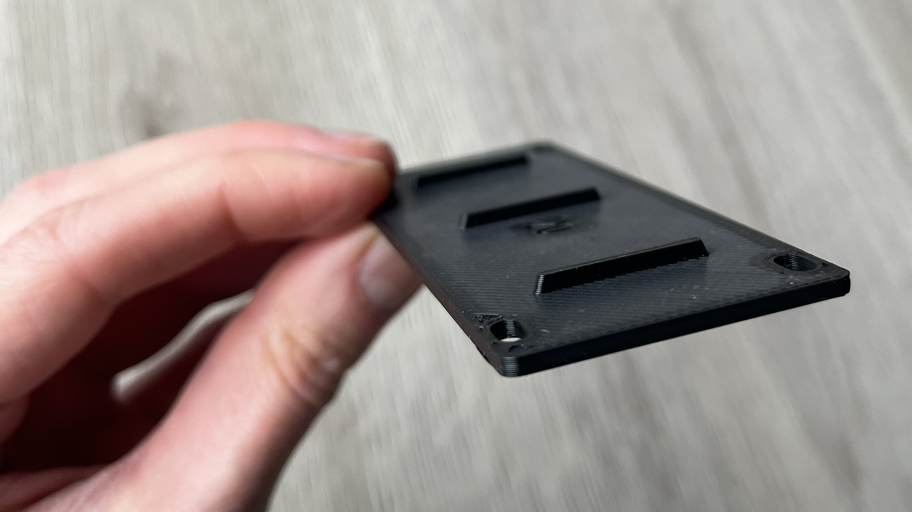

Blank panels for eurorack modular synth, based on intellijel specifications. Modular design: export custom sized panels.

My boyfriend spends a lot of his hard-earned cash on modular synth accessories; I made him some blank panels in matt black PLA+, so he didn't have to purchase them. After receiving the first panel he asked for a different size, and then one more… so I made a parametric design, to generate every possible size.

Feel free to use, share, remix, and give them to your modular friends. Spread some good vibes. Don't sell for a profit – modulars are already pricey enough.

**Notes about sizing:**
According to [Doepfer's specifications](https://www.doepfer.de/a100_man/a100m_e.htm) Ref2, the height of a panel is **1U 44.45mm** or **3U 133.4mm**. This measurement is from end-to-end, and doesn't account for the rim of the box. Depending on your box manufacturer, the height may be different. For example, the [Intellijel](https://intellijel.com/support/1u-technical-specifications/) panels should be **1U 39.65mm** or **3U 128.5mm**.

If you are printing panels for a non-Intellijel box, then modify the derived variable **d_depth** on line 45.

**Revision History:**
20250706: corrected length of 3U to meet specifications
20250919: migrated Tinkercad to OpenSCAD

**References:**
1. IJ specifications https://intellijel.com/support/1u-technical-specifications/
2. Doepfer A-100 Construction Details https://www.doepfer.de/a100_man/a100m_e.htm

### Customize
If the existing STL's don't meet your needs:
1. download the openscad file
2. modify the parameters
3. render a new design
4. export the STL

### Print
This design is not dependent on print settings. I used a Prusa MK4S with 0.4mm and 0.6mm nozzle, in PLA and PLA+.
Let the print cool on the plate, to avoid warping.

### Assembly
Use 6mm m3 screws, when the board is printed at its default 2mm thickness.

### Other
* Model is available on [Github](https://github.com/RobotAnna/3D_Designs/tree/main/Eurorack_blank_panels), [Printables](https://www.printables.com/model/1238459-eurorack-blank-panel-parametric), [Thingiverse](https://www.thingiverse.com/thing:6987462) and [Makerworld](https://makerworld.com/en/models/1236188-eurorack-blank-panel-parametric).
* Feel free to ask questions.
* The old design had strengthening ribs. I don't find it necessary. If you need the ribs, please ask, and I'll add it to the OpenSCAD code.

