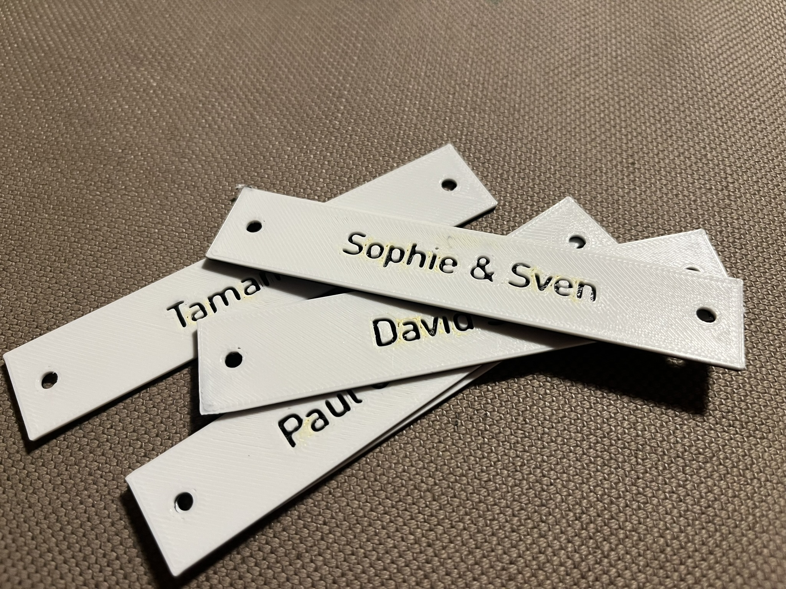
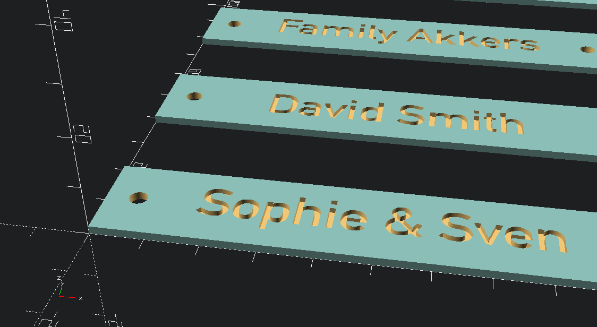
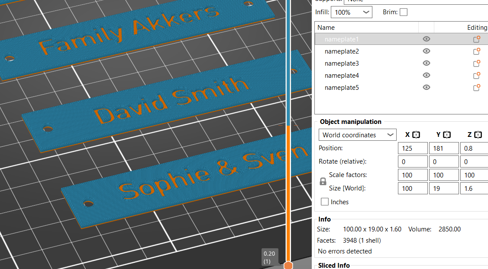
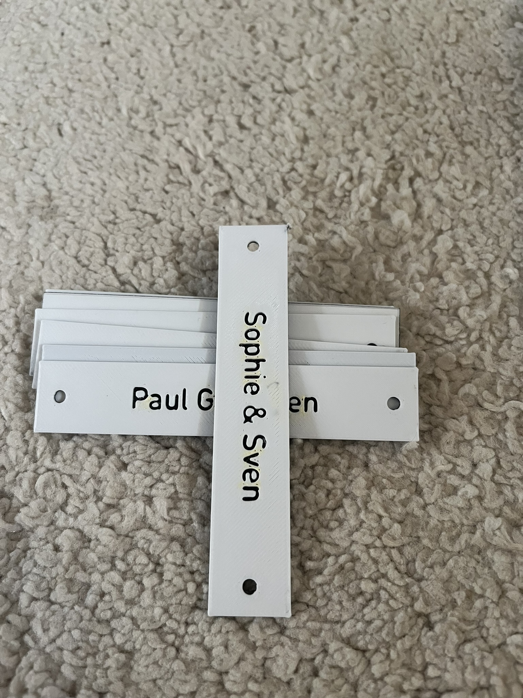

Parametric (adjustable) nameplates, for apartment mailboxes, doors, or whatever you like.

A friend asked me to print some name plates for his apartment building's mailboxes. I'm writing these instructions for myself, in case I need to print more later.

Feel free to use &/or modify this design for your own needs.

### Customize
You can customize these plates to any size, text &/or font:
1. download the openscad file
2. modify the parameters
3. render a new design
4. export the STL

### Print
I used the following settings in PrusaSlicer

* Print settings: 0.20mm STRUCTURAL
* Nozzle: HF0.4 nozzle
* Infill: 100%

Layers and perimeters:
* Layer height: 0.2mm
* First layer: 0.2mm
* Solid layers: 3 top and bottom
* Minimum shell thickness: 0.6mm top and bottom

Infill:
* Fill density: 100%
* Fill pattern: Rectilinear
* Top fill pattern: Monotonic lines

Add a color change after 3 layers. It should print 3x layers in the base color, and 5x layers in the top color. Eight layers in total.

### Other
* Tested on Prusa MK4S, in Prusament PETG.
* Model is available on [Github](https://github.com/RobotAnna/3D_Designs/tree/main/Nameplate_for_apartment_mailboxes), [Printables](https://www.printables.com/model/1359548-nameplate-for-apartment-mailboxes-parametric), [Thingiverse](https://www.thingiverse.com/thing:todo-broken-link) and [Makerworld](https://makerworld.com/en/models/1705294-nameplate-for-apartment-mailboxes-parametric).
* Feel free to ask questions.

