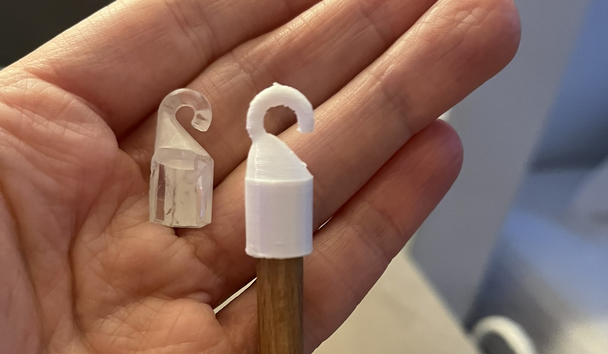
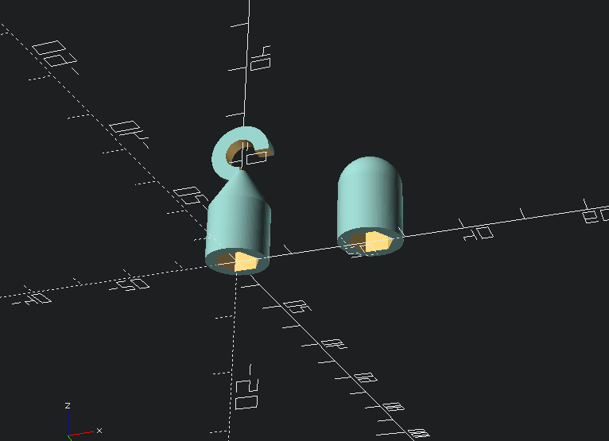
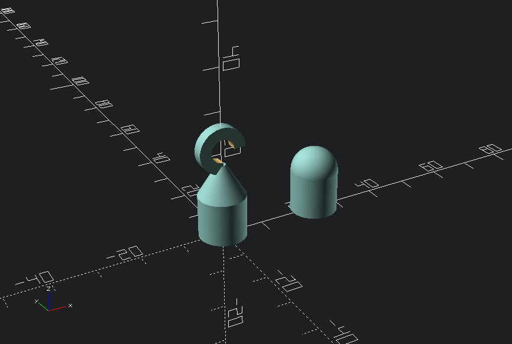
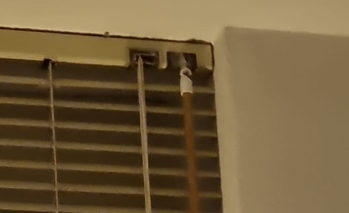

Make a replacement handle for your venetian blinds with a wooden rod and printed hook and end cap.

A friend's venetian blind was broken: no more handle. I made a new handle by printing a hook and end cap for an 8mm wooden dowel. Feel free to use this printfile, or alter the dimensions in OpenSCAD and export your own STL for any width rod.

### Print settings:
nozzle: 0.4mm or 0.6mm
layer height: 0.2mm

### Infill:
For added strength, try 40 - 50% gyroid or cubic infill.

### Assembly:
Print at 100%
Use an 8mm wooden dowel rod
Press-fit*
  If you are installing this in a house with children, please use a drop of glue to fix the caps.

### Other
* Tested on Prusa MK4S, in PETG.
* Model is available on [Github](https://github.com/RobotAnna/3D_Designs/tree/main/Replacement_handle_for_venetian_blinds), [Printables](https://www.printables.com/model/1253235-replacement-handle-for-venetian-blinds), [Thingiverse](https://www.thingiverse.com/thing:7047042) and [Makerworld](https://makerworld.com/en/models/1449457-replacement-handle-for-venetian-blinds).
* Feel free to ask questions.

