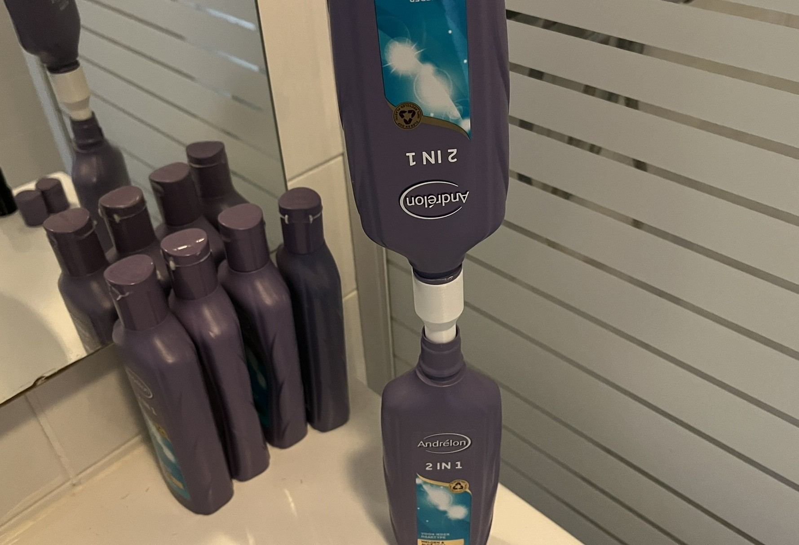
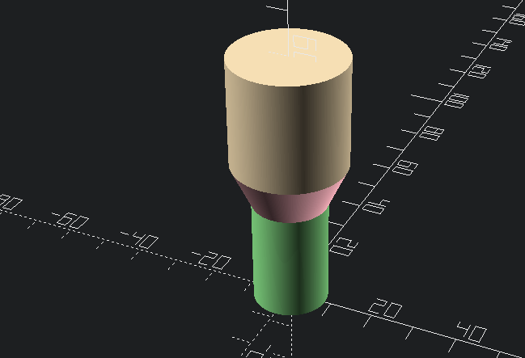
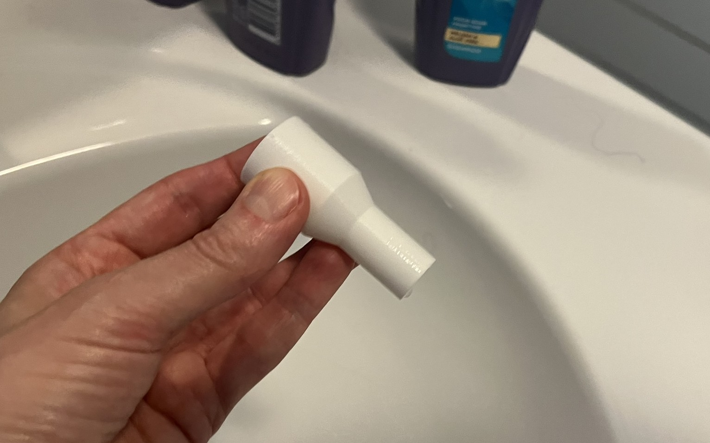

Decant your old shampoo bottles using this PLA funnel, printed in vase mode.

If your shampoo bottle is a different width, modify the design in OpenSCAD:
1. modify the parameters
2. render a new design
3. export the STL
It will look like a solid shape.

And then to turn your stl into a funnel, slice using the following settings in Prusa Slicer.

### Layers and perimeters
Enable “spiral vase”
Perimeters: 1
Solid layers: top 0, bottom 0

### Infill
Fill density: 0%

### Skirt and brim
2mm

### Advanced
Default extrusion width: 1mm
First layer: 1mm
Perimeters: 1mm
External perimeters: 1mm

### Other
* Nozzle width and layer height really don't matter. I used 0.4mm nozzle and made the layer height as large as possible, 0.28mm.
* Tested on Prusa MK4S, in PLA.
* Model is available on [Github](https://github.com/RobotAnna/3D_Designs/tree/main/Shunnel_Shampoo_Funnel), [Printables](https://www.printables.com/model/1386103-shunnel-shampoo-funnel-vase-mode-parametric), [Thingiverse](https://www.thingiverse.com/thing:7119425) and [Makerworld](https://makerworld.com/en/models/1705077-the-shunnel-shampoo-funnel-vase-mode).
* Feel free to ask questions.

